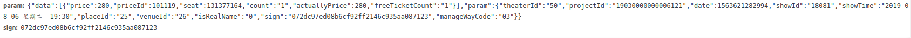

# polyt分析

## 私有全局变量

### dataBase变量

包含一下几个属性

1. zoomLevel
2. priceList
3. soldSeat
4. stage
5. seatId
6. idMapSeat

### 渲染数据renderData

包含一下几个属性或方法

1. priceList(data)  显示价格等级
2. querySalePrice(data) 
3. seatMap(data)    

initMapData()

getPriceGradeSeats()

### 交互interaction

包含以下几个函数

1. calcMapSize(data)
2. createOrder(Boolean)
3. setSeatContainerWidth
4. setSeatTitle
5. flyerToCart
6. zoomSeat
7. isShowInitStage
8. getOnlyAppointObj
9. commitSeat()

### 提交数据

